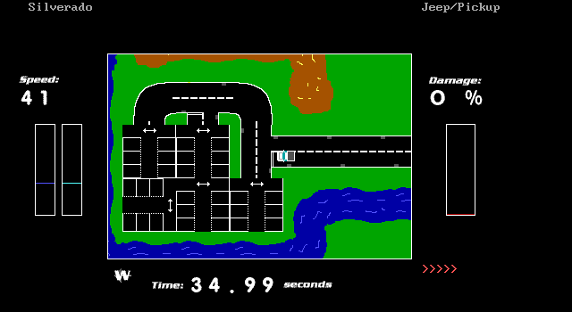

# Velocity 2 SE (1998)

An early teenage attempt at a racing game, in QBASIC. For historical interest only - 
this is unlikely to be good or idiomatic BASIC!

## Background

My school had a programming club, to which I can credit my first experience of
the fun (and occasional frustration) of being part of a hacking community, and
my first exposure to open source via a few shared RedHat and SuSE discs.

However playing with Linux was a one-off treat, and the majority of programming
club time was spent in the only programming environment common to all school
computers, namely Microsoft QBASIC.

Velocity 2 SE was the last QBASIC iteration of a series of driving games I'd
written, initally based on a single-screen game example from Wrox Publishing's
"Revolutionary Guide to QBASIC" using QBASIC's inbuilt drawing primitives and
evolving to the scrolling sprite-based game here.

The source presented here is largely unmodified, bar some minor adjustments
to remove a potential trademark infringement and to clean up the directory
structure for easier inspection.

## Running

You will need a QBASIC interpreter - I tested QuickBasic 4.5 running under DOSBOX,
but the regular QBASIC 1.1 bundled with DOS 6.x should also work (it was what we
used back in the day!)

QB64 will also compile it, although the PC speaker sounds appear to cause it some
problems. They can probably be commented out, it is not one of gaming's essential
soundtracks. This is likely to be the best option for performance if you cannot
run DOSBOX with a very high number of cycles.

CPU usage is quite high. The presence of red angle brackets (`>`) indicate the
game running below its expected frame rate; despite primitive graphics the original
required a 486/25 for smooth running, and ideally a 486 DX2/66 - this was one of
the main reasons I ended up learning C.

The main game is `V2SE_101.BAS`. It loads support files using relative paths so
make sure you have the working directory of your interpreter set to the root
directory.

There is also a track editor, `TRACKED2.BAS`. This tool is quite rudimentary, keys
are as follows:

| Key | Function |
|-----|----------|
| Arrows | Move |
| +/- | Select tile |
| Space | Place tile |
| C | Add a checkpoint (no way to remove, be careful!) |
| B | Place start |
| F | Place finish |
| D | Drawing mode (draw while moving) |

## Easter egg

Set your player name to "Whole Bucketloads of Toads". This is original from 1998.

## Commentary on some things I have learnt since

While a cynic may suggest the choice of implementation language is a fundamental
mistake from which I could never have recovered, there are a large number of
problems with the code stemming from inexperience and a "bash it until it works"
mentality. Such were those innocent childhood years before the discovery of beer and
data structures.

I'll discuss a few of the ones I found interesting.

### Global variable overload

Everything is a global variable! Everything is mutated by everything else!
I first encountered functional programming somewhere between late 2001 and early
2002, so at the time this was written I'd never heard of side-effects let alone
why they were bad. V2SE is fairly typical of my style at the time, where everything
that will ever be tracked is declared at the start of the file and then mutated by
subroutines. `GetFamilyName` is an excellent example of a side-effecting subroutine
where even the name is crying out for a function.

### Code repetition

Lines 1212-1331 handle track surface behaviour. This has a huge amount of repeated
code between surfaces with largely identical behaviour - especially the building
collision where there are two completely identical blocks of code with minorly
different `IF` statements!

### Use of multiple discrete variables where arrays would do

The use of `Angle` to select between `Car0`, `Car45`, ... , `Car315` turns up in a
whole load of different places - one wonders why there is not a single 
`GetCarSprite()` function and why these are not an array accessed as 
`Car(Angle / 45)`

### Subroutines relying on external side effects

`PlaySound` is interesting as a very convoluted way of playing the various bleeps and
blips of the PC speaker soundtrack - it attempts to emulate some level of polyphony
and was originally intended to be part of some aborted soundcard support. (You can
still find evidence of this in the code, I have no idea if it would work even if
you had a SoundBlaster-compatible card at 220h).

The subroutine relies on data being externally set so it can be read back with a
series of `READ` commands. Thread-safety was not a significant concern in the
QBASIC world but it's easy to see how an errant code modification could result in
all sorts of random junk being sent to the internal speaker.

### Code as data

A sixth of the entire line count is taken up by the subroutine `CarData`, which
mutates the global car performance variables according to what the user has selected
in an enormous `CASE` statement. What was wrong with putting these in data files,
especially given the game includes a car editor together with its own `LoadCEF`
function for loading a car definition from a file?

(The car editor naturally operates by mutating the same global variables `CarData`
does...)

### No data structures

Another peculiarity of V2SE is it uses only primitive BASIC data types, with multiple
variables (often global) used to effect the storage of values related to the same
object or concept. I suspect I was simply unaware of the `TYPE` statement, as it
does not appear in any code from the time. Knowledge of one's chosen implementation
language can be useful...